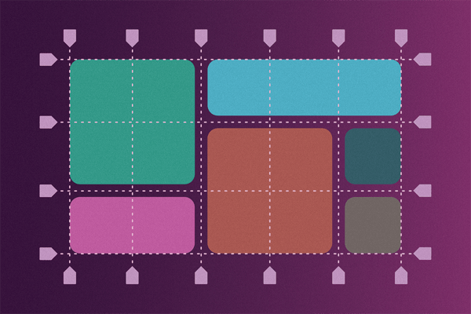

Pour créer une grille CSS, vous avez besoin de deux ingrédients:

- **Grid Container** : l'élément parent, le contenenur de la grille. Pour que la grille existe, il faut la déclarer sur un élément qui sera le parent.
- **Grid Item** : le ou les enfants directs d'un Grid Container. Ces éléments forment le "contenu" qui sera placé sur la grille.

### Terminologie:

Voici les termes à connaître, les éléments logiques qui constituent une grille:

- **Grid Line** : une ligne virtuelle, horizontale ou verticale, divisant la grille. Chaque ligne a un numéro, qui servira à placer les Grid Items.
- **Grid Track** : une piste, horizontale (row), ou verticale (column).
- **Grid Cell** : une cellule, une intersection entre deux pistes. La plus petite entité de positionnement.
- **Grid Area** : emplacement constitué d'une ou plusieurs *Grid Cell*, dans lequel se positionne un *Grid Item*.

