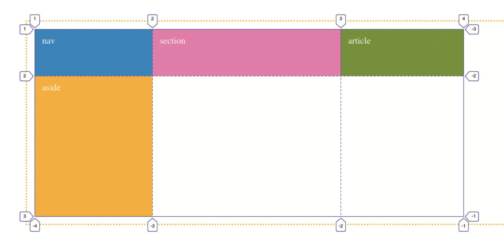

### Placer des éléments sur la grille

Une fois la grille déclarée, les éléments enfants (les *Grid Items*) vont se placer automatiquement dans l'ordre des cellules disponibles.

Si on veut définir des positions autres que la répartition automatique, on peut utiliser ces propriétés de placement: 

- `grid-column-start`
- `grid-column-end`
- `grid-row-start`
- `grid-row-end`
- `order`

Pour cela, il est important de comprendre comment fonctionnent les *Grid Lines*. Comme vous voyez sur cette image, chaque ligne possède un numéro:



Si on veut positionner un élément entre les lignes verticales 2 et 3, on écrira:

```css
section {
  grid-column-start: 2;
  grid-column-end: 3;
}
```

[Voici un codepen](https://codepen.io/eracom/pen/abwyybp?editors=1100) avec un exemple simple qui vous permet de vous exercer.

<p class="codepen" data-height="300" data-default-tab="html,result" data-slug-hash="abwyybp" data-preview="true" data-user="eracom" style="height: 300px; box-sizing: border-box; display: flex; align-items: center; justify-content: center; border: 2px solid; margin: 1em 0; padding: 1em;">
  <span>See the Pen <a href="https://codepen.io/eracom/pen/abwyybp">
  Goetter exemple No01</a> by Manuel Schmalstieg (<a href="https://codepen.io/eracom">@eracom</a>)
  on <a href="https://codepen.io">CodePen</a>.</span>
</p>
<script async src="https://cpwebassets.codepen.io/assets/embed/ei.js"></script>